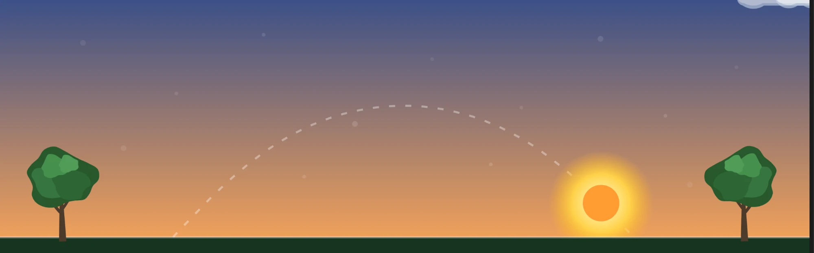
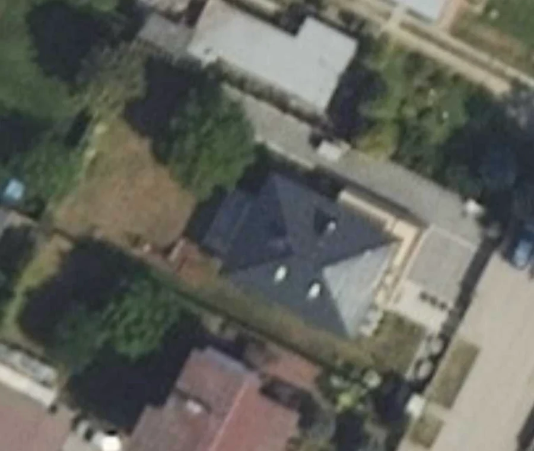
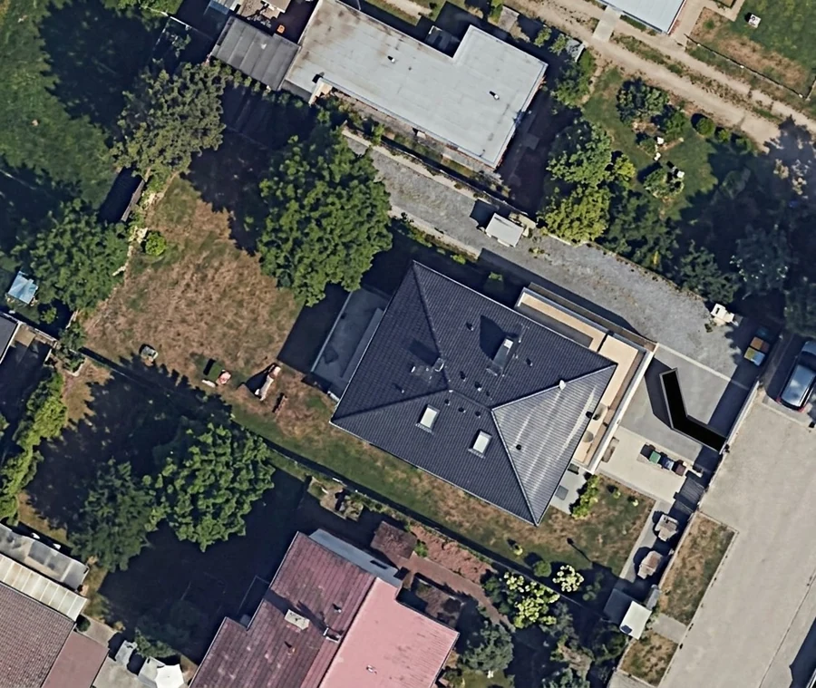

<p align="center">
  
</p>

# Oświetlenie ogrodu · Garden Lights Card

Karta Lovelace do Home Assistanta: plan ogrodu z lampami sterowanymi wschodem
i zachodem słońca, z animowanym niebem i pogodą.

*A Home Assistant Lovelace card: a garden plan with lamps driven by sunrise and
sunset, with an animated sky and live weather.*


**[Polski](#polski) · [English](#english)**

---

## Polski

### Co robi

**Słońce i księżyc naraz.** Pozycje obu ciał liczone są z astronomii pozycyjnej
dla współrzędnych z konfiguracji Home Assistanta — wysokość i azymut, a nie sam
postęp doby. Dzięki temu księżyc bywa widoczny w dzień, tak jak na prawdziwym
niebie; przy słońcu wysoko nad horyzontem jest po prostu bledszy. Dokładność
sprawdzona wobec `sun.sun`: różnica 0,05° wysokości i 0,01° azymutu.

Kreskowany łuk to **rzeczywista droga ciała po niebie w danym dniu**,
próbkowana tymi samymi wzorami, które ustawiają tarczę — więc tarcza zawsze
na nim leży. Latem łuk jest wysoki, zimą płaski.

Po wejściu na kartę niebo **odtwarza się od ostatniego wschodu do chwili
bieżącej** w ciągu około dwóch i pół sekundy. Animowany jest czas, więc obie
tarcze jadą swoimi prawdziwymi torami. Próg wschodu uwzględnia refrakcję
atmosferyczną (−0,833°), żeby zgadzał się z godziną z Home Assistanta.

Księżyc pokazuje **rzeczywistą fazę**, liczoną z elongacji względem Słońca,
bez żadnej dodatkowej encji. Sierp przybywający jest oświetlony po prawej,
ubywający po lewej — zgodnie z widokiem z półkuli północnej.

**Pogoda na niebie** (pole nieobowiązkowe):

| co w encji | co na karcie |
|---|---|
| zachmurzenie | od zera do czterech przepływających chmur |
| `rainy`, `lightning-rainy` | deszcz |
| `pouring` | ulewa, gęściej |
| `snowy`, `hail` | śnieg |
| `snowy-rainy` | deszcz ze śniegiem |

Zachmurzenie brane jest z atrybutu `cloud_coverage`, gdy encja go podaje — jest
dokładniejsze niż sama nazwa stanu.

Po bokach stoją **drzewa** rysowane proceduralnie: korona ma nieregularny,
wygładzony obrys wygenerowany z sumy harmonicznych, a zimowe gałęzie pochodzą
z rekurencyjnego rozgałęzienia, więc naturalnie zwężają się ku końcom. Drzewa są
zielone od wiosny do jesieni, zimą bez liści (na półkuli południowej pory roku
są przesunięte). Przy wietrze od 10 km/h zaczynają się bujać, powyżej 30 km/h
mocniej. Prędkość przeliczana jest z jednostki podanej przez encję — m/s, mph
i węzły też działają.

**Plan ogrodu z punktami świetlnymi.** Kliknięcie punktu przełącza przypisaną
encję, a świecąca lampa dostaje poświatę w swojej barwie. Wieczorem zdjęcie
przygasa proporcjonalnie do wysokości słońca — płynnie między +8° a −8°,
maksymalnie o wartość `dim_max`. Warstwa przyciemnienia leży **pod** punktami,
więc poświata lamp pozostaje czytelna także po zmroku.

**Offsety wschodu i zachodu.** O ile minut przed lub po zachodzie włączyć
i przed lub po wschodzie wyłączyć oświetlenie. Karta zapisuje je do encji
`input_number`, dzięki czemu czyta je zwykła automatyzacja Home Assistanta.

Animacje respektują systemowe ustawienie ograniczenia ruchu
(`prefers-reduced-motion`).

### Konfiguracja bez YAML-a

Edytor karty prowadzi przez cztery kroki i sam pokazuje, czego jeszcze brakuje:

1. **Zdjęcie ogrodu** — przycisk *Wgraj zdjęcie* wysyła plik do magazynu obrazów
   Home Assistanta. Nie trzeba niczego kopiować do `/config/www`.
2. **Lampy** — rozmieszczasz je klikając w zdjęcie.
3. **Sterowanie słońcem** — przycisk *Utwórz helpery* zakłada oba `input_number`
   z właściwym zakresem i jednostką. Tu też wskazuje się encję pogody.
4. **Automatyzacja** — wskazujesz automatyzację karty, dzięki czemu wykrywanie
   konfliktów wie, czego nie ruszać i co włączyć.

### Skąd wziąć zdjęcie ogrodu

Dowolne zdjęcie z góry. W Polsce
[Geoportal GUGiK](https://mapy.geoportal.gov.pl/imap/) udostępnia ortofotomapę
w rozdzielczości rzędu **5 cm na piksel** — kilkanaście razy dokładniej niż
popularne mapy internetowe — i obejmuje **cały kraj**. Link do niego jest też
w kroku 1 edytora. Poza Polską poszukaj krajowego odpowiednika albo użyj
własnego zdjęcia z drona.

Kadr najlepiej obrócić tak, żeby ulica była na dole, a głąb ogrodu na górze.

**Wyłącz wszystkie warstwy.** Geoportal domyślnie nakłada na zdjęcie granice
działek, numery ewidencyjne, nazwy ulic i inne oznaczenia. Zdejmij je wszystkie
i zostaw samą ortofotomapę — inaczej na karcie zostaną czerwone linie i napisy,
których nie da się już usunąć.

Potem wykadruj obszar swojej posesji i zrób zrzut ekranu.

#### Poprawa jakości

Zrzut bywa mało ostry, zwłaszcza po powiększeniu. Można go podciągnąć darmowym
narzędziem AI — na przykład Gemini. Sprawdzony prompt:

> to jest zdjęcie lotnicze, popraw jakość tego zdjęcia zachowując jak najwięcej
> szczegółów, nie zmieniaj nic na tym zdjęciu

Ostatni człon jest najważniejszy: bez niego narzędzie chętnie „upiększa" ujęcie,
dostawiając drzewa albo zmieniając kształt dachu.

| zrzut prosto z Geoportalu | po poprawie narzędziem AI |
|---|---|
|  |  |

Pamiętaj, że takie narzędzia **dorysowują** detal, którego w oryginale nie było.
Geometria zwykle zostaje nienaruszona, ale drobne tekstury są zmyślone. Do tła
karty nie ma to znaczenia, do celów pomiarowych już tak.

### Rozmieszczanie lamp

- **kliknięcie w wolne miejsce** obrazka dodaje punkt,
- **przytrzymanie i przeciągnięcie** punktu przesuwa go (działa też palcem),
- **kliknięcie w gotowy punkt** zaznacza go — wtedy można przypisać mu encję
  albo skasować.

Współrzędne zapisywane są w procentach szerokości i wysokości obrazka, więc
punkty trzymają się swoich miejsc niezależnie od rozmiaru ekranu.

### Barwa zapalenia

Lampy obsługujące kolor dostają **próbnik barwy** wprost przy sobie na liście —
karta rozpoznaje to po `supported_color_modes`. Lampy pozwalające regulować
tylko biel dostają pole **temperatury barwowej w kelwinach**. Zwykłe lampy
i gniazdka nie dostają nic.

Po ustawieniu barwy kliknięcie punktu zapala lampę przez `light.turn_on`
z `rgb_color` albo `color_temp_kelvin`, więc światło zawsze wstaje w tym samym
kolorze. Przycisk *Bez wymuszania* wraca do zwykłego przełączania.

### Wykrywanie konfliktów

Karta sprawdza, czy tymi samymi lampami nie steruje już coś innego.
Automatyzacje znajduje przez wyszukiwarkę powiązań Home Assistanta
(`search/related`), a harmonogramy — na przykład dodatek Scheduler — po
atrybucie `entities`. Pod uwagę bierze tylko aktywne, a własną automatyzację
karty pomija.

Gdy coś znajdzie, pokazuje pasek z wyjaśnieniem i przyciskiem, który wyłącza
kolidujące wpisy i włącza automatyzację wskazaną w kroku 4.

### Instalacja

HACS → menu ⋮ → **Custom repositories** → wklej adres tego repozytorium,
typ **Dashboard** → Add → następnie **Download**.

Instalacja ręczna: skopiuj `dist/ogrod-swiatla-card.js` do `/config/www/`
i dodaj zasób `/local/ogrod-swiatla-card.js` typu **JavaScript Module**
w Ustawienia → Dashboardy → ⋮ → Zasoby.

### Konfiguracja

```yaml
type: custom:ogrod-swiatla-card
title: Oświetlenie ogrodu
image: /local/ogrod.jpg
sun_entity: sun.sun
weather_entity: weather.home
offset_zachod_entity: input_number.ogrod_offset_zachod
offset_wschod_entity: input_number.ogrod_offset_wschod
automation_entity: automation.ogrod_swiatla
dim_max: 0.5
points:
  - entity: light.ogrod_lampa_1
    x: 33
    y: 18
    color: "#ffd07a"
  - entity: switch.ogrod_lampa_2
    x: 70
    y: 27
```

| pole | domyślnie | znaczenie |
|---|---|---|
| `title` | `Oswietlenie ogrodu` | nagłówek karty |
| `image` | — | tło karty; `x` i `y` punktów w procentach jego wymiarów |
| `sun_entity` | `sun.sun` | encja słońca |
| `weather_entity` | — | encja pogody; bez niej niebo zostaje czyste |
| `offset_zachod_entity` | — | `input_number` z przesunięciem włączenia |
| `offset_wschod_entity` | — | `input_number` z przesunięciem wyłączenia |
| `automation_entity` | — | automatyzacja karty, włączana przy konflikcie |
| `dim_max` | `0.5` | maksymalne nocne przyciemnienie tła, `0`–`1` |
| `points` | `[]` | lista punktów świetlnych |

Punkt przyjmuje `entity`, `x`, `y` oraz opcjonalnie `color` (`#rrggbb`)
albo `color_temp_kelvin`.

### Helpery offsetów

Najprościej utworzyć je przyciskiem w kroku 3 edytora. Odpowiednik w YAML-u:

```yaml
input_number:
  ogrod_offset_zachod:
    name: Ogród – włącz względem zachodu
    min: -120
    max: 120
    step: 5
    unit_of_measurement: min
    icon: mdi:weather-sunset-down
    mode: box
  ogrod_offset_wschod:
    name: Ogród – wyłącz względem wschodu
    min: -120
    max: 120
    step: 5
    unit_of_measurement: min
    icon: mdi:weather-sunset-up
    mode: box
```

Wartość **ujemna oznacza przed** zdarzeniem, **dodatnia po** zdarzeniu.
Przykładowo `-15` przy zachodzie to „włącz kwadrans przed zachodem".

### Automatyzacja

Karta pokazuje stan i pozwala ustawić offsety, ale światła przełącza
automatyzacja. Wyzwalacze szablonowe zawierają `now()`, więc Home Assistant
przelicza je na początku każdej minuty, a reakcja następuje wyłącznie na zmianę
stanu okna — dzięki temu ręczne zgaszenie lampy w nocy nie jest cofane.

```yaml
alias: Ogród – oświetlenie wg wschodu i zachodu słońca
mode: single
triggers:
  - trigger: template
    id: wlacz
    value_template: >
      
      
      false
      
      
      
      
      {{ t >= ns + ofz }}{{ t < nr + ofw }}
      
  - trigger: template
    id: wylacz
    value_template: >
      
      
      false
      
      
      
      
      {{ not (t >= ns + ofz) }}{{ not (t < nr + ofw) }}
      
actions:
  - choose:
      - conditions:
          - condition: trigger
            id: wlacz
        sequence:
          - action: homeassistant.turn_on
            target:
              entity_id: &lampy
                - light.ogrod_lampa_1
                - switch.ogrod_lampa_2
      - conditions:
          - condition: trigger
            id: wylacz
        sequence:
          - action: homeassistant.turn_off
            target:
              entity_id: *lampy
```

Jeśli masz już inne harmonogramy na te same lampy, karta je wykryje
i zaproponuje wyłączenie.


### Wesprzyj

Karta powstała po godzinach i jest za darmo, razem z kodem. Jeśli oszczędziła
Ci wieczoru grzebania w YAML-u albo po prostu ładnie wygląda na ścianie, możesz
postawić kawę przez [GitHub Sponsors](https://github.com/sponsors/jokers1975).
Ten sam skutek ma przycisk **Sponsor** w nagłówku repozytorium.

Wsparcie niczego nie odblokowuje — karta była i zostaje w całości darmowa.

---

## English

### What it does

**Sun and moon at the same time.** Both positions come from positional astronomy
using the coordinates in your Home Assistant configuration — altitude and
azimuth, not a simple progress-through-the-day value. That is why the moon can
appear during daylight, exactly as it does in the real sky, just fainter while
the sun is high. Accuracy checked against `sun.sun`: 0.05° in altitude and
0.01° in azimuth.

The dashed arc is the **real path of the body across the sky on that day**,
sampled with the same formulas that place the disc, so the disc always sits on
it. High in summer, flat in winter.

When you open the card, the sky **replays from the last rise up to the current
moment** over about two and a half seconds. Time is what gets animated, so both
discs travel their true paths. The rise threshold includes atmospheric
refraction (−0.833°) so it matches the time Home Assistant reports.

The moon shows its **real phase**, derived from its elongation from the sun,
with no extra entity required. A waxing crescent is lit on the right, a waning
one on the left — as seen from the northern hemisphere.

**Weather in the sky** (optional):

| entity state | what you see |
|---|---|
| cloud coverage | zero to four drifting clouds |
| `rainy`, `lightning-rainy` | rain |
| `pouring` | heavier rain |
| `snowy`, `hail` | snow |
| `snowy-rainy` | sleet |

Cloud cover is read from the `cloud_coverage` attribute when the entity
provides it, which is more precise than the state name alone.

**Trees** stand on both sides, drawn procedurally: the canopy outline is an
irregular, smoothed shape generated from a sum of harmonics, and the winter
branches come from recursive branching, so they taper naturally. Trees are green
from spring through autumn and bare in winter (seasons are shifted in the
southern hemisphere). They start swaying above 10 km/h of wind and sway harder
above 30 km/h. Wind speed is converted from whatever unit the entity reports —
m/s, mph and knots all work.

**Garden plan with light points.** Clicking a point toggles its entity, and a
lit lamp gets a glow in its own colour. In the evening the photo dims in
proportion to the sun's altitude — smoothly between +8° and −8°, up to
`dim_max`. The dimming layer sits **below** the points, so the lamp glow stays
readable after dark.

**Sunrise and sunset offsets.** How many minutes before or after sunset to
switch on, and before or after sunrise to switch off. The card stores them in
`input_number` entities, so an ordinary Home Assistant automation can read them.

Animations honour the system reduced-motion preference.

### Setup without YAML

The card editor walks through four steps and shows what is still missing:

1. **Garden photo** — the *Upload* button sends the file to the Home Assistant
   image store. Nothing needs to be copied into `/config/www`.
2. **Lamps** — place them by clicking on the photo.
3. **Sun control** — a button creates both `input_number` helpers with the right
   range and unit. The weather entity is chosen here too.
4. **Automation** — point the card at your automation so conflict detection
   knows what to leave alone and what to enable.

### Where to get an aerial photo

Any top-down image will do. In Poland the national geoportal
([GUGiK](https://mapy.geoportal.gov.pl/imap/)) publishes orthophotos at roughly
**5 cm per pixel**, far sharper than common web maps, covering the whole
country; the editor links to it. Elsewhere, look for your national mapping
agency or use your own drone shot.

Rotate the frame so the street is at the bottom and the far end of the garden
at the top.

**Turn every overlay off.** Geoportal draws parcel boundaries, cadastral
numbers, street names and other markings on top of the imagery by default.
Switch them all off and keep only the orthophoto layer — otherwise those red
lines and labels end up baked into your card background for good.

Then frame your property and take a screenshot.

#### Sharpening the screenshot

Screenshots often look soft, especially when zoomed in. A free AI tool such as
Gemini can clean them up. A prompt that works well:

> this is an aerial photograph, improve its quality while preserving as much
> detail as possible, do not change anything in this photograph

That last clause matters most: without it the tool happily "improves" the scene,
adding trees or reshaping roofs.

| straight from Geoportal | after AI enhancement |
|---|---|
|  |  |

Keep in mind that such tools **invent** detail that was never in the original.
Geometry usually survives intact, but fine textures are fabricated. That is
harmless for a card background and unacceptable for anything measured.

### Placing lamps

- **click an empty spot** on the image to add a point,
- **press and drag** a point to move it (works with a finger too),
- **click an existing point** to select it, then assign an entity or delete it.

Coordinates are stored as percentages of the image, so points stay put at any
screen size.

### Colour

Lamps that support colour get a **colour swatch** right next to them in the
list — detected from `supported_color_modes`. Lamps that only support tunable
white get a **colour temperature** field in kelvin instead. Plain lamps and
switches get neither.

Once a colour is set, clicking the point turns the lamp on through
`light.turn_on` with `rgb_color` or `color_temp_kelvin`, so it always comes up
the same. The *no override* button restores plain toggling.

### Conflict detection

The card checks whether something else already drives the same lamps.
Automations are found through Home Assistant's related-items search
(`search/related`), and schedulers — the Scheduler add-on, for instance —
through their `entities` attribute. Only active ones count, and the card's own
automation is excluded.

When it finds something, it shows an explanatory banner with a button that
disables the conflicting entries and enables the automation chosen in step 4.

### Installation

HACS → ⋮ menu → **Custom repositories** → paste this repository's URL,
category **Dashboard** → Add → then **Download**.

Manual: copy `dist/ogrod-swiatla-card.js` into `/config/www/` and register
`/local/ogrod-swiatla-card.js` as a **JavaScript Module** resource under
Settings → Dashboards → ⋮ → Resources.

### Options

See the Polish configuration table above; the option names are the same. In
short: `image`, `sun_entity`, `weather_entity`, `offset_zachod_entity`
(switch-on offset), `offset_wschod_entity` (switch-off offset),
`automation_entity`, `dim_max` and `points`. Each point takes `entity`, `x`,
`y` and optionally `color` (`#rrggbb`) or `color_temp_kelvin`.

A negative offset means **before** the event, a positive one **after**.


### Support

This card was built after hours and is free, source and all. If it saved you an
evening of wrestling with YAML, or simply looks good on your wall, you can buy
me a coffee through [GitHub Sponsors](https://github.com/sponsors/jokers1975).
The **Sponsor** button in the repository header does the same thing.

Sponsoring unlocks nothing — the card was and stays entirely free.

---

## Licencja · License

MIT.
